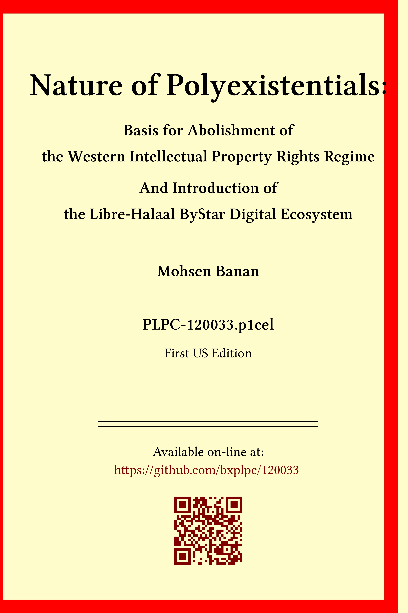

------------------------------------------------------------------------

# The Nature of Poly-Existentials:

## Basis for Abolishment of 

## The Western Intellectual Property Rights Regime

## And Introduction of the Libre-Halaal ByStar Digital Ecosystem

## the Libre-Halaal ByStar Digital Ecosystem

# PLPC-120033

<a href="/content/generated/doc.free/mohsen/PLPC/120033/current/PLPC-120033.bib">[Printed Books At Amazon]

 
 
<table>
<tbody>
<tr class="odd">
<td>Document Number:</td>
<td>PLPC-120033   <a href="/content/generated/doc.free/mohsen/PLPC/120033/current/PLPC-120033.bib">[ .bib ]</a></td>
</tr>
<tr class="even">
<td>Version:</td>
<td>0.15</td>
</tr>
<tr class="odd">
<td>Dated:</td>
<td>January 27, 2019</td>
</tr>
<tr class="even">
<td>Group:</td>
<td>polyExistential</td>
</tr>
<tr class="odd">
<td>Primary URL:</td>
<td><a href="http://mohsen.1.banan.byname.net/PLPC/120033">http://mohsen.1.banan.byname.net/PLPC/120033</a></td>
</tr>
<tr class="even">
<td>Federated Publications:</td>
<td><a href="http://bytopic/PLPC/120033">ByTopic</a> -- <a href="http://bycontent/PLPC/120033">ByContent</a></td>
</tr>
<tr class="odd">
<td>AccessPage Revision:</td>
<td>This AccessPage was produced on March 15, 2023 at 18:36 PDT (-0700)</td>
</tr>
<tr class="even">
<td>Author(s):</td>
<td><a href="http://mohsen.1.banan.byname.net/contact">Mohsen BANAN</a></td>
</tr>
</tbody>
</table>

AVAILABLE FORMATS  

-   [PDF](/content/generated/doc.free/mohsen/PLPC/120033/current/articleEnFa.pdf):
    -- -- Provides the document in Portable Document Format.
-   [HTML](/content/generated/doc.free/mohsen/PLPC/120033/current/articleEnFa/index.html):
    -- -- Displays the document as a web page.

AVAILABLE OTHER FORMS  

-   [c-120033-natureOfPolyExistentials-8.5x11.pdf](/content/generated/doc.free/mohsen/PLPC/120033/current/c-120033-natureOfPolyExistentials-8.5x11.pdf):
    -- -- Complete document in pdf format -- US Letter (8.5x11) Paper
    Size .
-   [c-120033-natureOfPolyExistentials-a4.pdf](/content/generated/doc.free/mohsen/PLPC/120033/current/c-120033-natureOfPolyExistentials-a4.pdf):
    -- -- Complete document in pdf format -- A4 paper size .
-   [c-120033-natureOfPolyExistentials-17.5x23.5.pdf](/content/generated/doc.free/mohsen/PLPC/120033/current/c-120033-natureOfPolyExistentials-17.5x23.5.pdf):
    -- -- Complete document in pdf format -- 17.5cmx23.5cm paper size .
-   [c-120033-natureOfPolyExistentials-6x9.pdf](/content/generated/doc.free/mohsen/PLPC/120033/current/c-120033-natureOfPolyExistentials-6x9.pdf):
    -- -- Complete document in pdf format -- 6inx9in paper size .

SHORT DESCRIPTION  

That which exists in nature in multiples, we call polyexistentials.
Information and knowledge exist in nature in multiples. Information and
knowledge are polyexistentials. This is in contrast with what exists in
nature in singular which we call monoexistentials.

In this document we analyze the topic of Intellectual Property Rights
(IPR) from a new perspective. The topic of restriction of
polyexistentials and Western IPR are one and the same. Yet, the concept
of polyexistentials has not appeared in prior discussions of this topic.
This is the very first time that the concept and the word
“polyexistetials” are being introduced.

Models of ownership of subjects can only be considered valid only when
they are consistent with forms of possession and existence of subjects.
Manner of existence and possession of polyexistentials make them
unownable.

The concept of polyexistence makes the fraudulence of Western IPR clear
and obvious.

Beyond rejecting Western IPR and calling for its abolishment we
introduce the "Libre-Halaal" label for the
[halaal](http://mohsen.1.banan.byname.net/PLPC/120039)
manner-of-existence of polyexistentials towards proper models for their
governance. Based on that, we then provide definitional criteria for
[Libre-Halaal Software](http://www.halaalsoftware.org) and [Libre-Halaal
Internet Services](http://www.libreservices.org).

Towards a cure, as a a moral alterantive to the proprietary american
digital ecosystem we put forward the [The Libre-Halaal ByStar Digital
Ecosystem](http://www.by-star.net).

Equipped with our blueprint and our initial implementation of the ByStar
digital ecosystem we then turn our attention to economics and business.
We introduce the model of [Global Polyexistential
Capitalism](http://www.by-star.net/PLPC/120042) and based on that bring
forward [Neda’s Open Business Plan for
ByStar](http://www.neda.com/strategicVision/businessPlan).

Our main goal for all of this has been to influence societal policies
towards adoption of halaal manner-of-existence of polyexistentials in
Eastern societies in general and Iran in particular. The last chapter of
this document focuses on the model of Libre-Halaal polyexistentials as a
replacement for the Western IPR regime.

  
  

  
  

------------------------------------------------------------------------

FULL INLINE DOCUMENT

  
